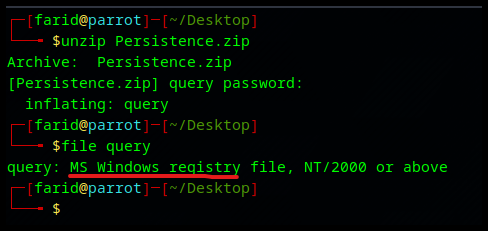

# 🛡️ Persistence

Track: Intro to Blue Team

Link: [https://app.hackthebox.com/challenges/Persistence](https://app.hackthebox.com/challenges/Persistence)

## Summary

We're noticing some strange connections from a critical PC that can't be replaced. We've run an AV scan to delete the malicious files and rebooted the box, but the connections get re-established. We've taken a backup of some critical system files, can you help us figure out what's going on?

## Write Up

I downloaded the challenge file. After unzipping it, I found a file named `query`. I used the `file` command to identify the type of file:

<figure><figcaption></figcaption></figure>

It is a Windows Registry file. Since I'm using Linux, I needed to install `reglookup` to view the file contents. I used the following commands to install `reglookup` on my Parrot OS:

```
sudo apt update
sudo apt install reglookup chntpw
```

The summary mentions that the AV found the malicious file but it keeps reappearing. The first places in the Windows Registry to check for persistence are the following four locations:

* `HKEY_LOCAL_MACHINE\Software\Microsoft\Windows\CurrentVersion\Run`
* `HKEY_LOCAL_MACHINE\Software\Microsoft\Windows\CurrentVersion\RunOnce`
* `HKEY_CURRENT_USER\Software\Microsoft\Windows\CurrentVersion\Run`
* `HKEY_CURRENT_USER\Software\Microsoft\Windows\CurrentVersion\RunOnce`

We can use `grep` to find the keys:

```
sudo reglookup query | grep -E "Run|RunOnce"
```

<figure><figcaption></figcaption></figure>

We found a suspicious-looking EXE under `Run`. The file name looks encoded. It seems to be base64, so let's try decoding it.

<figure><figcaption></figcaption></figure>

FLAG: **`HTB{1_C4n_kw3ry_4LR19h7}`**
